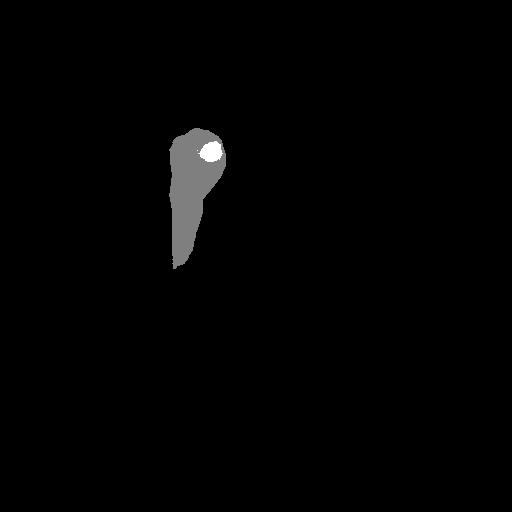
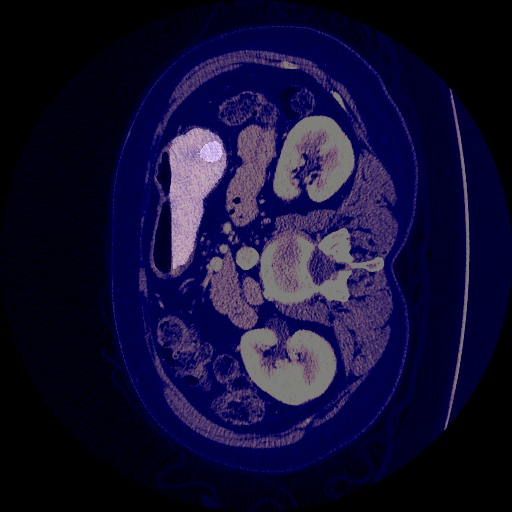

# GUI-Liver-Tumor-Segmentation-using-UNet

## Convert UI to py File
Use Command Prompt or CMD to convert UI file to py file

`pyside6-uic autosegApps.ui > UI_autosegApps.py`

## Run  
`python main.py`

## Ouput
Output in the form of liver tumor segmentation and overlay an image segmentation

 

## Requirements
1. Tensorflow
2. Keras
3. PySide6
4. Open-CV python
5. pyqtgraph
